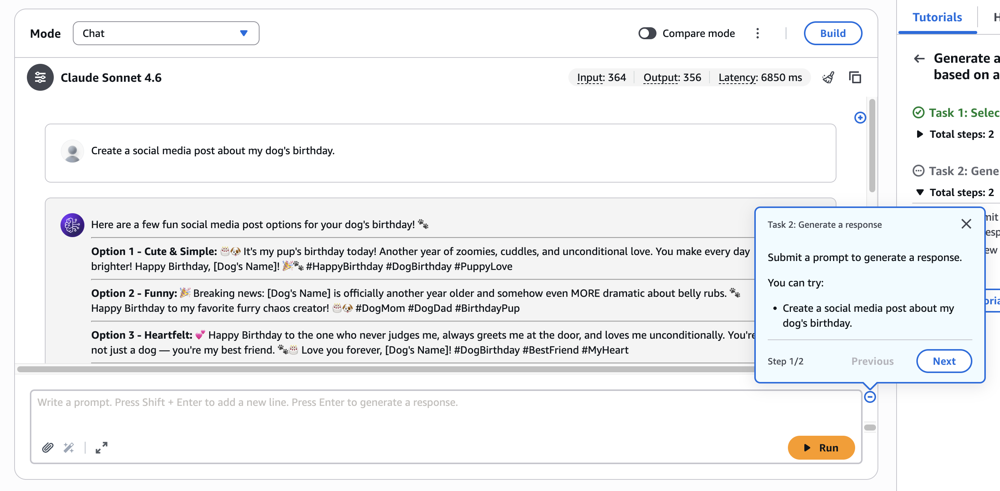
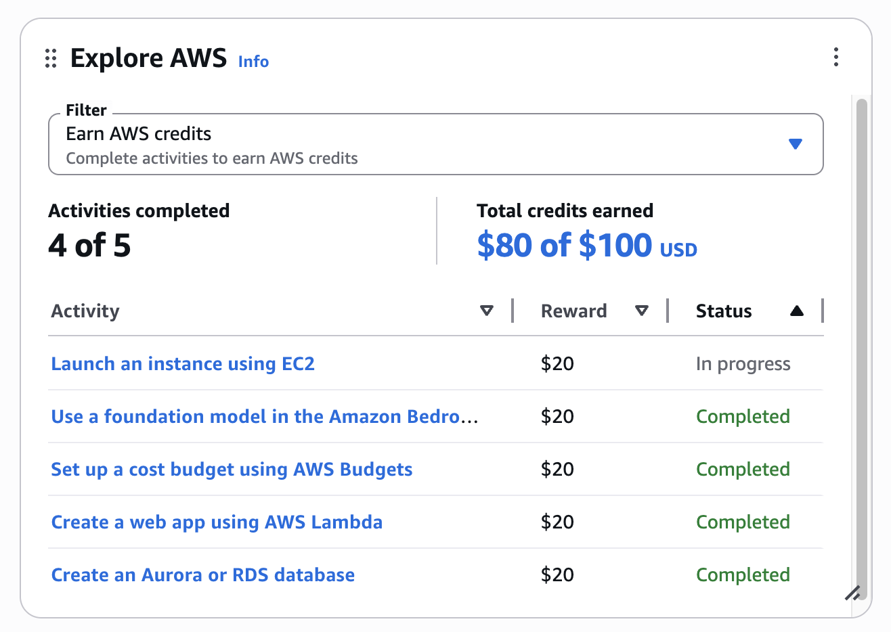

When you create a new AWS account, you're offered **$100 in credits** for completing five "Explore AWS" activities — things like launching an EC2 instance, creating a Lambda function, and setting up a budget. Each one is worth $20.

I looked at the list and thought: can I just automate all of this with Terraform? Turns out, four out of five can be fully automated. The fifth — Bedrock — specifically requires the AWS Console UI. Not ideal, but five minutes of clicking isn't going to kill anyone.

## What Terraform handles

Four of the five activities are straightforward Terraform resources. No tricks, no workarounds:

1. **Launch an instance using EC2** — a single `t3.micro` is enough to trigger the credit. `aws_instance` resource, done.
2. **Set up a cost budget using AWS Budgets** — entirely declarative via `aws_budgets_budget`. Set a $10 monthly budget and move on.
3. **Create a web app using AWS Lambda** — a minimal Python function via `aws_lambda_function`. Doesn't need to do anything useful — just exist.
4. **Create an Aurora or RDS database** — `aws_db_instance` with MySQL. This is the slowest part (~5 minutes to provision), but `skip_final_snapshot = true` and `deletion_protection = false` mean `terraform destroy` cleans it up fast.

The Terraform config runs entirely in `us-east-1` using the default VPC — no need to worry about service availability in other regions. RDS password is auto-generated via `random_password` and never touches disk or git.

## The one you have to do manually: Bedrock

The Bedrock credit activity is titled "Use a foundation model in the **Amazon Bedrock console**" — emphasis on *console*. It specifically requires interaction via the Bedrock playground UI, not an API call. No amount of Terraform or CLI invocations will satisfy it.

Here's what to do:

1. Go to **AWS Console → Amazon Bedrock → Playgrounds → Chat** (in `us-east-1`)
2. Click **Start activity** on the Bedrock credit
3. Select a model from **Anthropic, DeepSeek, OpenAI, or Qwen3** (Nova Micro does not qualify)
4. Submit any prompt and view the response
5. Step through the tutorial prompts to complete



The tutorial UI has a bug where it won't let you advance past step 2 of Task 2. Doesn't matter — the credit is awarded based on the underlying API call, not whether you clicked through the full tutorial. Submit a prompt, see a response, credit triggers.

Takes about two minutes. Not worth losing sleep over.

## Running it

Grab the full Terraform config from [this gist](https://gist.github.com/jch254/8cc251ffd7c7c4ed6fafa505ce808eb3), then:

```bash
terraform init
terraform apply
# complete the Bedrock console activity manually
# wait for credits to register, then:
terraform destroy
```

Provision, claim, destroy. $80 in credits for a single `terraform apply`, plus $20 more for two minutes in the Bedrock playground. Not bad.



The EC2 credit shows as "In progress" immediately after apply — it takes a few minutes to register once the instance is running. Leave it a bit before running `terraform destroy`.

## Full Terraform code

```hcl
# ============================================================
# AWS Credits - Standalone Terraform
# Run locally to trigger the 5 Explore AWS credit activities.
#
# Usage:
#   cd scripts/aws-credits
#   terraform init
#   terraform apply
#   terraform destroy   ← run once credits are awarded
#
# DO NOT COMMIT THIS FILE (add to .gitignore if needed)
# ============================================================

terraform {
  required_version = ">= 1.0"

  required_providers {
    aws = {
      source  = "hashicorp/aws"
      version = "~> 5.0"
    }
    archive = {
      source  = "hashicorp/archive"
      version = "~> 2.0"
    }
    random = {
      source  = "hashicorp/random"
      version = "~> 3.0"
    }
  }
  # Local state only - not stored remotely
}

provider "aws" {
  region = "us-east-1"
}

locals {
  name = "aws-credits"
}

# ──────────────────────────────────────────────────────────────
# Shared: default VPC and subnets
# ──────────────────────────────────────────────────────────────
data "aws_vpc" "default" {
  default = true
}

data "aws_subnets" "default" {
  filter {
    name   = "vpc-id"
    values = [data.aws_vpc.default.id]
  }
}

# ──────────────────────────────────────────────────────────────
# 1. EC2 instance  →  $20 credit: "Launch an instance using EC2"
# ──────────────────────────────────────────────────────────────
data "aws_ami" "amazon_linux" {
  most_recent = true
  owners      = ["amazon"]

  filter {
    name   = "name"
    values = ["al2023-ami-*-x86_64"]
  }

  filter {
    name   = "state"
    values = ["available"]
  }
}

resource "aws_security_group" "ec2" {
  name        = "${local.name}-ec2-sg"
  description = "Temporary SG for credits EC2 instance"
  vpc_id      = data.aws_vpc.default.id

  egress {
    from_port   = 0
    to_port     = 0
    protocol    = "-1"
    cidr_blocks = ["0.0.0.0/0"]
  }

  tags = { Name = "${local.name}-ec2" }
}

resource "aws_instance" "credits" {
  ami                    = data.aws_ami.amazon_linux.id
  instance_type          = "t3.micro"
  subnet_id              = data.aws_subnets.default.ids[0]
  vpc_security_group_ids = [aws_security_group.ec2.id]

  tags = { Name = "${local.name}-ec2" }
}

# ──────────────────────────────────────────────────────────────
# 2. AWS Budgets  →  $20 credit: "Set up a cost budget using AWS Budgets"
# ──────────────────────────────────────────────────────────────
resource "aws_budgets_budget" "credits" {
  name         = "${local.name}-budget"
  budget_type  = "COST"
  limit_amount = "10"
  limit_unit   = "USD"
  time_unit    = "MONTHLY"
}

# ──────────────────────────────────────────────────────────────
# 3. Lambda  →  $20 credit: "Create a web app using AWS Lambda"
# ──────────────────────────────────────────────────────────────
data "archive_file" "lambda" {
  type        = "zip"
  output_path = "${path.module}/lambda.zip"

  source {
    content  = <<-PY
      def handler(event, context):
          return {"statusCode": 200, "body": "OK"}
    PY
    filename = "index.py"
  }
}

resource "aws_iam_role" "lambda" {
  name = "${local.name}-lambda-role"

  assume_role_policy = jsonencode({
    Version = "2012-10-17"
    Statement = [{
      Effect    = "Allow"
      Principal = { Service = "lambda.amazonaws.com" }
      Action    = "sts:AssumeRole"
    }]
  })
}

resource "aws_iam_role_policy_attachment" "lambda_basic" {
  role       = aws_iam_role.lambda.name
  policy_arn = "arn:aws:iam::aws:policy/service-role/AWSLambdaBasicExecutionRole"
}

resource "aws_lambda_function" "credits" {
  function_name    = "${local.name}-web-app"
  role             = aws_iam_role.lambda.arn
  handler          = "index.handler"
  runtime          = "python3.13"
  filename         = data.archive_file.lambda.output_path
  source_code_hash = data.archive_file.lambda.output_base64sha256
  timeout          = 30

  tags = { Name = "${local.name}-lambda" }
}

# ──────────────────────────────────────────────────────────────
# 4. RDS  →  $20 credit: "Create an Aurora or RDS database"
# ──────────────────────────────────────────────────────────────
resource "random_password" "rds" {
  length           = 16
  special          = true
  override_special = "!#$%&*()-_=+[]{}<>:?"
}

resource "aws_db_subnet_group" "credits" {
  name       = "${local.name}-db-subnet-group"
  subnet_ids = data.aws_subnets.default.ids

  tags = { Name = "${local.name}-db" }
}

resource "aws_security_group" "rds" {
  name        = "${local.name}-rds-sg"
  description = "Temporary SG for credits RDS instance"
  vpc_id      = data.aws_vpc.default.id

  tags = { Name = "${local.name}-rds" }
}

resource "aws_db_instance" "credits" {
  identifier             = "${local.name}-db"
  engine                 = "mysql"
  engine_version         = "8.0"
  instance_class         = "db.t3.micro"
  allocated_storage      = 20
  db_name                = "credits"
  username               = "admin"
  password               = random_password.rds.result
  db_subnet_group_name   = aws_db_subnet_group.credits.name
  vpc_security_group_ids = [aws_security_group.rds.id]
  skip_final_snapshot    = true
  publicly_accessible    = false
  deletion_protection    = false

  tags = { Name = "${local.name}-db" }
}

# ──────────────────────────────────────────────────────────────
# Outputs
# ──────────────────────────────────────────────────────────────
output "ec2_instance_id" {
  value = aws_instance.credits.id
}

output "rds_endpoint" {
  value = aws_db_instance.credits.endpoint
}
```
