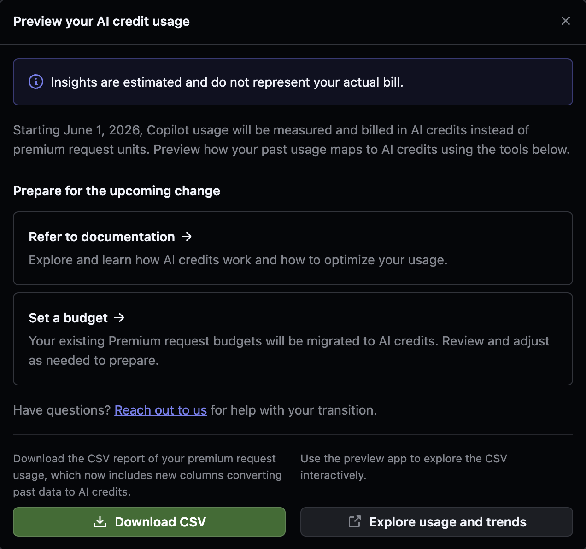
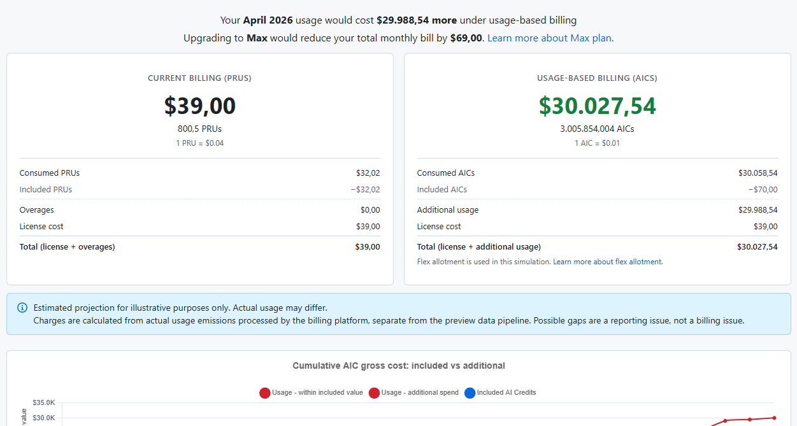

My annual Copilot Pro+ subscription ran out almost exactly as GitHub changed what Copilot feels like to use.

That was luck, not planning. I had been coding daily for months, rebuilding momentum on my own systems, and Copilot was at the centre of that. Agent sessions, code review, model switching, the lot. I knew the renewal date was coming and I assumed the decision would be automatic.

Then GitHub announced that from June 1, 2026, Copilot usage is measured and billed in AI Credits instead of Premium Request Units. They shipped a preview tool so you can see what your past usage maps to under the new model.

I ran my April through it.

---

## While I was writing this

A few days into drafting this, I went to ship a normal Android build in Claude Code and got stopped by this:

> There's an issue with the selected model (claude-fable-5). It may not exist or you may not have access to it.

Nothing wrong with my build. Anthropic had suspended access to Fable 5 and Mythos 5 under a US government directive. I posted the screenshot and notes on [LinkedIn](https://www.linkedin.com/posts/jch254_ai-anthropic-claude-ugcPost-7471390878629199872-DRCf/), but the source of record is [Anthropic's own statement](https://www.anthropic.com/news/fable-mythos-access).

Different vendor, different mechanism, same shape. The Copilot story is about pricing becoming unpredictable. This was a model I used yesterday being gone today, for reasons that have nothing to do with my code or my bill. Pricing changes, model access removal, vendor governance, and jurisdictional decisions all land in the same place. The tool in your editor stops behaving the way it did, and you did not get a say.

---

## The April numbers

Under the old model, April cost me $147.38. That was the $39 Pro+ licence, 4,209.5 Premium Request Units at $0.04 each, minus the included allowance, leaving $108.38 in overages. Not cheap. I knew what I was using and I was fine paying for it.

The same month under AI Credits: 132,848.995 AICs at $0.01 each, or $1,328.49 of consumed credits. After the included $70 allowance and the $39 licence cost, the total came out to $1,297.49.

Same work. Same sessions. Same code shipped. $1,150.11 more, according to GitHub's own preview.

I was never riding the subsidised end of the subscription either. My metered billing for 2026 shows real overage payments on top of the licence: $141.28 billed in March, $107.42 in April. I was a paying overage customer who knew roughly what a heavy day cost. The preview tool repriced that same consumption at nearly nine times the spend.

The preview also helpfully notes that upgrading to the new Max plan would reduce my monthly bill by $69.00. Off a $1,150 increase. Thanks.

GitHub flags that these previews are estimates and not an actual bill, and that is fair. But it is their tool, their conversion, their data pipeline. If the estimate is badly wrong, that is its own problem.

---

## This is not a price rise

If GitHub had put Pro+ up from $39 to $59, I would have grumbled and paid. Prices rise. Model inference is expensive. Everyone in this market is repricing.

This is a different kind of change. It swaps the mental model of the product.

A subscription with a generous allowance feels like a tool you own for the month. You reach for it without thinking. You let an agent take a long speculative run at a refactor because the marginal cost of trying is zero. You burn a few requests asking a dumb question because dumb questions are how you learn a codebase.

A metered tool feels like a taxi. The meter changes your behaviour even when the fare is small, because you can feel it running. Every open-ended task now carries a background question: what is this going to cost? Not in tokens. In money, on a bill, next month.

That question is poison for the exact workflows Copilot has spent two years selling.

---

## Agentic coding is the worst possible fit for this

The whole pitch of agentic coding is that you hand over open-ended work. Explore this codebase. Find the bug. Refactor this module and fix whatever breaks. The value comes from the model being allowed to iterate, read widely, take wrong turns, and recover.

None of it can be estimated up front. Not by me, and apparently not by the pricing model either, because that is exactly where the PRU-to-AIC conversion explodes. A Premium Request Unit priced the request. AI Credits meter consumption at a much finer grain, so a long context-heavy agent session that used to count as a handful of requests now bills like what it actually is underneath: an enormous amount of inference.

I understand why GitHub wants that. Per-request pricing on agentic workloads probably lost them money on every power user, and I was presumably one of them. Aligning price with cost is rational.

But it quietly moves the risk onto the developer. Under PRUs, an agent that went down a rabbit hole wasted a few requests. Under AI Credits, an agent that goes down a rabbit hole spends your money the whole way down, and you find out the magnitude when the meter is read. The tool's failure modes are now billable.

So you start supervising the meter instead of the work. Shorter prompts, smaller scopes, fewer speculative runs. You use the tool less ambitiously, which is another way of saying the tool got worse.

---

## Developer tooling as a FinOps exercise

The part that actually got me was GitHub's own transition modal.

Read the documentation to learn how to optimise your usage. Set a budget, because your existing Premium Request budgets are being migrated. Download the CSV of your historical usage, now with new columns converting past data to AI Credits. Explore usage and trends in the preview app.

Budgets. CSV exports. Usage trend dashboards. Optimisation guides.

This is cloud billing. I have spent enough years doing AWS cost work to recognise the genre instantly. Cost Explorer, budget alarms, usage reports, the optimisation doc you read after the surprising bill. It is a reasonable toolkit for infrastructure, where spend is an operational concern owned by people whose job is to watch it.

It is a strange thing to bolt onto a code editor. When the onboarding for a developer tool is "set a budget and download your usage CSV", the product is telling you what it has become. The cost of a thought is now a line item, and you are the FinOps team.

---

## The $30,000 edge of the model

My own numbers are bad. Numbers circulating in a GitHub community thread are worse.

One screenshot shows a user whose April was $39.00 under the current model. Their 800.5 PRUs fit entirely inside the included allowance. A customer with no overage at all.

The same month converted to 3,005,854.004 AI Credits, or $30,058.54 of consumed credits. After the included $70 allowance and the $39 licence cost, the preview total came out to $30,027.54. A difference of $29,988.54.

I want to be careful here. This is a screenshot from a thread, not my bill. I cannot see what their workload was, and I would not treat it as a typical case. It may be a conversion bug, or some pathological agent workload that the PRU model was absorbing for free. GitHub's preview explicitly says gaps between the pipelines are a reporting issue, not a billing issue.

But that is partly the point. When the plausible preview range for a $39 subscriber runs from $39 to $30,000, nobody can reason about the model at all. Even if the extreme case is wrong, nobody outside GitHub can tell whether it is wrong. That opacity is the problem. A pricing model people can reason about should not need a preview app, a CSV export, and a disclaimer about which pipeline to believe before users can tell whether April was normal or catastrophic.

---

## Where I landed

I did not renew.

Again, mostly luck. I already had an Anthropic Pro subscription that I upgraded to Max, and I have OpenAI Plus alongside it. The timing was convenient in another way too: the current Claude and GPT/Codex tooling had just become strong enough that Copilot no longer had to be the centre of my workflow. A year ago dropping it would have hurt. This month it was mostly a billing decision.

That is the part GitHub should worry about. I was the good customer. Daily user, annual subscriber, happily paying overages, Copilot wired into everything. The new model did not push me out with a price I refused to pay. It pushed me out with a price I could no longer predict, at the exact moment alternatives with flat, comprehensible subscriptions got good enough.

Fixed-price plans almost certainly have their own ceilings and fair-use lines, and the economics that broke PRUs will pressure everyone eventually. I am not pretending the grass is permanently greener. But today, one set of tools lets me start an open-ended agent session without doing mental arithmetic, and one does not.

---

## Predictability is the product

Developer tools earn trust in a boring way. They behave the same every day, they cost the same every month, and they fade into the workflow until you stop thinking about them. That is the entire value of a subscription. You pay to stop thinking.

GitHub took the most useful parts of Copilot, the open-ended agentic parts, and attached them to a meter that its own preview tool prices anywhere from slightly more to nearly nine times more, and in one community-thread screenshot 770 times more. Then it handed developers budgets and CSVs and told them to optimise.

Maybe the credits are priced fairly against real inference costs. I genuinely cannot tell, and that is the indictment. A tool I trusted enough to leave running in my editor every day became a tool whose monthly cost I cannot estimate to the nearest thousand dollars.

Copilot did not just get more expensive. It became less predictable, and predictable was the thing I was paying for.
