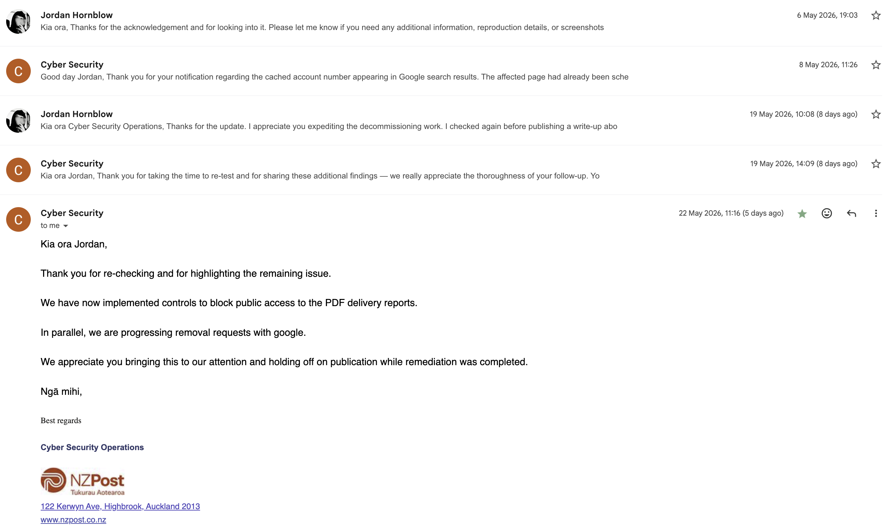

After almost two months of silence, NZ Post replied to my disclosure on the same day I sent a firmer follow-up.

Two days later, they confirmed the affected legacy page had been expedited for decommissioning. It now redirected to the modern parcel tracking service, and they had asked for the outdated result to be removed from public search.

That looked like a good outcome.

It turned out to be only part of one.

The thing that stuck with me was not that I had found a clever exploit. I had not. I was trying to understand a parcel status on one of my own deliveries, searched Google, and ended up looking at an old CourierPost interface that should not have been discoverable that way.

Search engines have always connected fragments that people assume nobody will assemble. A name, a cached page, an old indexed interface, a date field that someone forgot was internet-facing. None of it secret. None of it obvious either. The web has always behaved more like a memory system than a collection of pages.

I am writing about it now because both the original interface and the related PDF exposure have been remediated, and because I am leaving out the details that would make any of it reproducible.

---

## Search has always been stranger than people think

The status was "Redirection requested". I Googled the phrase to find out how long that usually took. One of the results was an older CourierPost track-and-trace page.

It had an account number prefilled and a date field. I ran the search out of curiosity. The interface came back with a warning that more than 200 records were available.

That was the bit that changed it.

The interface was not asking for a tracking number. It was offering me a way to discover them.

---

## What I found

I am not going to walk anyone through how to reproduce this. The URL does not matter here. The shape of the system does.

An older public search page on a CourierPost track-and-trace host. It took an account number and a date and returned shipment records. The account number was already filled in. Narrowing by status returned a list of tracking numbers.

Each record had the usual tracking-page information. Status history. Movement timestamps. The sender business that booked the courier. The name of whoever signed. Some signature metadata. A rough delivery locality.

If you already know a tracking number, none of that is surprising. Tracking pages are designed to be reachable. That is fair.

The concern was that the search interface flipped the direction. You did not need a tracking number. You arrived with a date and walked away with a list.

That is a different security posture. There was no credential boundary. The real boundary was obscurity.

---

## Boring metadata, in aggregate

A single tracking record looks mundane. That is true.

It only stays mundane while records stay isolated.

The same fields at scale tell a different story. The senders are businesses with logistics patterns. The signers are real people. The dates form timelines. The localities form rough maps. Across enough records, you can describe how a sender ships, when, where, and to whom.

None of that is a credit card number or a home address. That is part of why I tried to be measured in the disclosure.

But this is the aggregation problem. Boring metadata stops being boring once you can stack it.

---

## The disclosure

I asked for advice before doing anything public. Someone with more infosec and media experience sanity-checked it.

Tracking data is often already accessible if you know the tracking number. There were no addresses or contact details in the records. What stood out was access to lists of tracking numbers, the prefilled account number, and an old corporate-facing interface ending up in Google. There also appeared to be an indexing-control mismatch. The kind of small legacy detail that looks boring until it leaves the wrong thing visible in search. Old-school Google dorking, basically. Not against some hardened target. Against software nobody seemed to be thinking about anymore.

On 13 March 2026 I sent NZ Post Cyber Security a responsible disclosure. I described it as a legacy CourierPost search interface enabling enumeration of tracking numbers and shipment metadata. I estimated severity as medium to high, mostly because of discoverability rather than per-record sensitivity. I said I had not collected data beyond confirming the behaviour, and offered to provide additional details privately if needed.

I followed up on 24 March. Nothing.

On 6 May, after almost two months of silence, I sent a firmer follow-up and asked whether involving media would be a better way to get the issue in front of the right people. They replied the same day. They apologised for missing the earlier emails and said they were reviewing it.

On 8 May, NZ Post replied again. They said the affected legacy page had already been scheduled for decommissioning, and that after confirming my report they expedited that work. The page now redirected to the modern parcel tracking service. They had also submitted a request to remove the outdated result from public search.

I am not going to dunk on them for the silence. The eventual response was reasonable and the fix was correct.

I will say this. Disclosure channels need to function reliably. Silence creates an awkward position for the reporter, and two months of it made me consider going to media to force movement. That is bad for everyone involved.

---

## Partial fix, indexed PDFs

I held off publishing while I verified the fix end to end. Eleven days after their first confirmation I went back and re-tested. I am glad I did.

The old search interface was gone. The legacy URLs now redirected to the modern parcel tracking service. That part of the fix held.

What had not been addressed was the PDF delivery reports. Those reports were still indexed by Google and still downloadable directly from search results. A `site:` query into the legacy host still returned pages of records. Each PDF contained the kind of fields the original disclosure was about: tracking numbers, delivery status, depot details, customer references, delivery timestamps, signed-for names, and signatures.

The redirect fix covered the legacy Track & Trace pages. It did not cover the generated reports those workflows had produced.

I sent NZ Post an update the same day, on 19 May, describing what was still reachable. They replied that day and acknowledged it as a separate remediation gap, not something covered by the initial decommissioning. They said they were investigating and would update me once that work was complete.

On 22 May they confirmed they had implemented controls to block public access to the PDF delivery reports and were progressing removal requests with Google.

I held off publishing again while re-testing the controls and waiting for NZ Post to verify their fix had stuck across both rounds.

I only became comfortable publishing once that second piece had been remediated. The story up to 8 May would have been "old interface gone". The story now is closer to the truth. The exposure was an ecosystem, not a page. Decommissioning the front door did not decommission the artifacts the front door used to surface.

---

## Internet archaeology

Old systems do not become safe because nobody remembers them. Internet-facing legacy software becomes archaeology. It sits there, still running, still indexed, still answering requests, until a search engine, a crawler, a cache, or a curious person follows an edge into it.

Most organisations have something like this. A reporting screen from a previous platform. A search page built for staff workflows. A PDF generator that was never meant to be indexed. A bucket of report artifacts that quietly outlived the interface that produced them.

These are usually the result of operational drift rather than a single decision. Someone who owned the page left. Someone else assumed it had been turned off. Someone else assumed search engines would not find it. The system kept running because decommissioning cost more than leaving it in place.

Then one day a routine parcel status phrase points back at it.

The PDF gap follows the same pattern. The interface was on someone's roadmap to retire. The reports it generated probably were not. They lived in a different layer, with a different owner, on a different mental model. The decommissioning plan covered the part of the system that still had active operational visibility.

Legacy systems are ecosystems. Front-ends, generated artifacts, storage layers, indexing rules, and old URLs that nobody is still mapping. Turning off one layer does not turn off the others.

This is one reason I care about boring platform discipline. Infrastructure as code, self-contained repositories, clear owners, deploy pipelines, monitoring, and documented decommissioning paths are not just tidy engineering habits. They make it harder for systems to become ghosts. If nobody can tell where a service lives, how it deploys, who owns it, or what depends on it, turning it off becomes risky. So it stays alive.

---

## The next version of this problem

I found this with ordinary Google. That is worth saying clearly.

The economics of this kind of discovery are changing.

Anthropic recently announced [Project Glasswing](https://www.anthropic.com/glasswing), built around Claude Mythos Preview, a frontier model used for defensive vulnerability research. One example stuck with me. Mythos reportedly found a 27-year-old vulnerability in OpenBSD, an operating system famous for taking security seriously. It also found a 16-year-old issue in FFmpeg and chained vulnerabilities in the Linux kernel.

OpenAI is moving in the same direction with [GPT-5.5 and GPT-5.5-Cyber through Trusted Access for Cyber](https://openai.com/index/gpt-5-5-with-trusted-access-for-cyber/). The framing is defensive, with identity checks and stronger controls around more capable workflows, but the direction is hard to miss. Models are becoming useful for vulnerability identification, triage, patch validation, and controlled security testing.

That matters here because the next version of this problem is not just "someone Googles a weird parcel status".

It is a model reading indexed pages, classifying old interfaces, explaining what they probably do, and suggesting the next thing to check. It is the boring connective work getting cheaper. Labelling pages. Comparing fragments. Summarising old workflows. Turning a vague discovery into a plan.

That does not mean AI magically finds every hidden system. It means the cost of patience is falling.

Indexed legacy interfaces are discovered more reliably and described more usefully than before. The cost of doing what I did sits a step lower than it did a year ago, and it is going to keep falling.

Indexed legacy pages are not really dormant. They are inputs for whatever finds them next.

---

## What stayed with me

I am glad I handled it through responsible disclosure. I am glad both parts were eventually fixed.

NZ Post got there. The first remediation was the obvious one. The second one clarified the real shape of the exposure. The issue was not a single page. It was a legacy ecosystem with surfaces nobody was actively watching. Responsible disclosure worked, even if it took a louder follow-up and a re-test to get there.

What stays with me is how ordinary the discovery was. No zero-day. No clever exploit chain. Just search, operational drift, and an old interface that should not have been reachable, sitting on top of artifacts that should not have been indexed.

Search turns weak assumptions into maps. That has been true for a long time. The map is just easier to read now, and the ghosts are easier to find.
