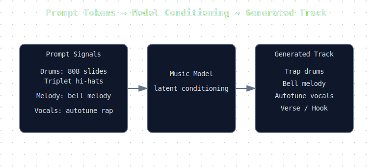

After generating a few dozen songs with Suno, something counter-intuitive becomes obvious.

The prompts that *look* the most detailed rarely produce the best music.

The model responds far more strongly to a small set of **musical signals**: drum patterns, instrumentation and arrangement structure.

Once you start prompting in those terms, the results get noticeably better.

---

## Think Like a Producer, Not a Prompt Writer

The mental model that works best is to structure prompts the way a producer might describe a track in the studio.

```
drums → melody → vocals → structure → mix
```

Music models appear to prioritize earlier tokens, so placing the **rhythm section first** often improves results.

For example, this simple trap prompt consistently generates recognisable ATL-style beats:

```
Genre: ATL melodic trap
Tempo: slow trap bounce

Drums: 808 slides, triplet hi-hats
Melody: eerie bells, dark synth pads
Vocal: melodic autotune rap

Structure: intro → verse → hook → verse → hook → bridge → outro
```

The key signals aren't adjectives like *professional*, *cinematic*, or *high quality*.

They're **production primitives**:

* 808 slides
* triplet hi-hats
* bell melody
* autotune rap

Interestingly, [Suno's own documentation](https://help.suno.com/en/articles/9010177) suggests a similar approach, encouraging prompts built around musical elements and production cues rather than purely descriptive language.

These are patterns the model likely saw thousands of times during training.

---

## How Prompt Signals Shape the Output

Below is a simplified diagram of how prompts condition the model.

<figure>
  
  <figcaption>Prompt tokens act as conditioning signals that steer the model toward regions of music it learned during training.</figcaption>
</figure>

Prompt tokens don't act like instructions. They behave more like **statistical hints** about what kind of music the model should generate.

---

## Example: Prompt → Generated Track

Prompt:

```
Genre: ATL melodic trap
Tempo: slow trap bounce

Drums: 808 slides, triplet hi-hats
Melody: eerie bells
Vocal: melodic autotune rap

Structure: intro → verse → hook → verse → hook → outro
```

Result:

<figure class="mt-8">
  <SoundCloud url="https://soundcloud.com/jch254/speed-dial" />
  <figcaption>Generated with the prompt above using Suno.</figcaption>
</figure>

---

## Signal Density Beats Prompt Length

Turns out **short prompts outperform long ones**.

Compare these two prompts.

Bad prompt:

> A dark atmospheric trap song with modern production, emotional melodies and professional sound design.

Better prompt:

```
808 slides
triplet hi-hats
bell melody
autotune rap
```

The second prompt maps directly to **recognizable production patterns**.

You're essentially telling the model:

> Generate something in the region of music where these ingredients usually appear together.

---

## Arrangement Controls Song Length

Another thing you quickly notice: Suno often generates **1–2 minute songs** unless you explicitly guide the arrangement.

Adding additional sections tends to extend the track.

```
Structure:
extended intro → verse → hook → verse → hook → bridge → final hook → outro
```

Tokens like **bridge**, **breakdown**, and **outro** encourage the model to generate additional sections.

---

## Small Details Make Tracks Feel Real

A trick that improves realism is prompting for a **producer tag intro**.

Many hip-hop songs begin with a producer tag before the beat drops.

```
Intro: producer tag then beat drop
```

That small cue often pushes the structure closer to how real tracks are arranged.

---

## Example: Soul Sample Hip Hop

Prompt:

```
Genre: soulful boom bap hip hop

Drums: boom bap drums
Melody: chopped soul samples, piano chords
Vocal: storytelling rap

Structure: intro → verse → hook → verse → hook → outro
```

Result:

<figure class="mt-8">
  <SoundCloud url="https://soundcloud.com/jch254/cryin-for-you" />
  <figcaption>Generated with the prompt above using Suno.</figcaption>
</figure>

---

## Example: Cinematic Hip Hop

Prompt:

```
Genre: cinematic hip hop

Drums: heavy hip hop drums
Melody: orchestral strings, choir samples
Vocal: expressive rap

Structure: intro → verse → epic hook → verse → hook → outro
```

Result:

<figure class="mt-8">
  <SoundCloud url="https://soundcloud.com/jch254/in-my-room" />
  <figcaption>Generated with the prompt above using Suno.</figcaption>
</figure>

---

## The Real Workflow: Batch Generation

The first generation is rarely the best.

Because the model samples randomly, running the same prompt several times produces very different tracks.

A typical workflow looks like this:

1. Generate several tracks from the same prompt
2. Keep the best generation
3. Extend or remix that version

It feels more like **auditioning ideas in a studio session** than generating a finished song.

---

## What This Suggests About Generative Models

Experimenting with Suno reveals a broader pattern in generative AI.

Across different domains, models respond less to **natural language descriptions** and more to **tokens that map directly to the structure of the data they were trained on**.

In code models, those signals are things like:

* function signatures
* test cases
* example inputs

In image models, they're often:

* composition cues
* lighting styles
* camera angles

And in music models, they turn out to be:

* drum patterns
* instrumentation
* arrangement structure

In other words, the most effective prompts tend to describe **the building blocks of the medium**, not the vibe of the output.

Once you notice this, prompting feels less like writing instructions and more like **nudging the model toward a region of its training distribution**.

For music models, those regions might be defined by combinations like:

```
808 slides
triplet hi-hats
bell melody
autotune rap
```

For image models it might be:

```
35mm film
dramatic lighting
shallow depth of field
```

And for code models it might look like:

```
input example
expected output
edge cases
```

Different mediums, same underlying mechanism.

The models aren't following instructions so much as **pattern matching across huge training distributions**.

Prompt engineering is less about clever phrasing and more about **understanding the statistical structure of the domain you're generating in**.

Once you start thinking about prompts that way, the behavior of these systems becomes a lot more predictable.

---

## AI Music Models Start to Feel Like Collaborators

After enough experimentation, the interesting part isn't that AI can generate music.

It's how the interaction starts to resemble collaboration.

You don't specify every detail. You give the system a few production cues and explore what it produces.

Sometimes the result is chaotic.
Sometimes it's generic.

But occasionally the model lands on something that sounds uncannily like a real track.

When that happens, it stops feeling like a generator. It starts feeling like **another producer in the room**.

The more time I spend with generative models, the less they feel like tools you instruct. They feel more like systems you learn to collaborate with.
