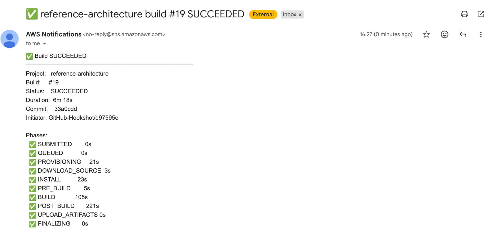

I pushed three commits over a few hours. Nothing deployed.

There were no failures. The builds never started.

No error emails. No Slack alerts. CodeBuild wasn't failing. It just wasn't running.

The only thing that had changed was the repo name.

## What's actually broken

When you create a CodeBuild project linked to a GitHub repo, AWS stores the full repository URL in the source configuration. It also registers a webhook on the GitHub side that points back to CodeBuild.

Renaming a repo on GitHub creates a redirect from the old URL to the new one. `git push` and `git clone` follow that redirect. So does the browser. Everything looks normal.

But **the webhook doesn't survive the rename cleanly**. GitHub may delete it, or leave it in a broken state. In my repro, it was either missing or present but returning HTTP 400. The CodeBuild console still showed the old repo name in the source config, and Terraform still believed the webhook existed because the provider read from AWS CodeBuild continued to report it as present.

**No webhook means no trigger.** Pushes land fine. Nothing fires. The build never starts.

## Symptoms

- Pushes to the renamed repo don't trigger builds
- The CodeBuild project shows no recent build history
- `git push` works fine, no errors
- The webhook may be missing from the renamed repo's GitHub Settings
- The webhook may still appear in GitHub but return HTTP 400
- The CodeBuild console still shows the old repo name in the source config
- CloudWatch has no CodeBuild logs for the period

The webhook state is the key failure. After the rename, it may be deleted or left broken. Terraform still believes it exists based on the provider read from AWS CodeBuild, so nothing recreates it.

## The fix

Update the source location in your Terraform config to match the new repo name.

```hcl
source {
  type     = "GITHUB"
  location = "https://github.com/org/new-repo-name"
}
```

Run `terraform plan`. If it shows an update, apply it.

That alone is not enough.

If the webhook was deleted or left broken during the rename, Terraform will still think it exists and won't recreate it.

Force-replace it:

```bash
terraform destroy -target=aws_codebuild_webhook.main
terraform apply -target=aws_codebuild_webhook.main
```

That removes the stale state and creates a fresh webhook on the renamed repo. You should see it appear in the repo's GitHub Settings under Webhooks immediately after.

If you're not using Terraform, delete the webhook in GitHub and reconnect the source in the CodeBuild console. Same outcome.

## Why this is dangerous

GitHub repo renames are supposed to be safe. Git operations keep working. Links redirect. Everything looks fine. Everything looks correct. Then you notice nothing is happening.

The problem is that redirects do not propagate through integrations. Git follows them. Browsers follow them. AWS CodeBuild does not surface that loss of linkage through its API.

You rename the repo with confidence, and nothing breaks visibly. The pipeline just stops running.

There is no alert for "builds that should have started but didn't". The only signal is absence.

## I didn't have build notifications set up

That made this worse. A few commits went in before I noticed nothing was deploying.

Failure alerts would not have helped here. The builds never started. There were no failures.

What would have helped is noticing missing success notifications. If you're used to seeing "build succeeded" emails and they stop, that is your signal.

CodeBuild supports this with SNS. This went through three iterations.

### Round 1: CodeStar Notifications + SNS

The first attempt used AWS CodeStar Notifications, which has native CodeBuild integration. Create a notification rule, point it at an SNS topic, add an email subscription, done. The emails were raw JSON blobs from AWS with no formatting. Functional.

This is also where the GitHub rename bug bit. The fix to `source_location` was bundled into this same commit because the rename had already silently broken the webhook.

### Round 2: EventBridge instead of CodeStar

CodeStar Notifications isn't available in `ap-southeast-4` (Melbourne). The next iteration replaced the notification rule with an EventBridge rule that watched for `CodeBuild Build State Change` events and routed them directly to SNS. Same raw JSON email output, but actually deployable in the target region.

### Round 3: Lambda formatter in the middle

Direct EventBridge to SNS produces an unreadable wall of JSON. The final iteration inserted a small Node.js Lambda between EventBridge and SNS. EventBridge triggers the Lambda. The Lambda formats the event. SNS sends the email.

The formatter produces a human-readable layout:

```text
❌ Build FAILED
────────────────────────────────────────
Project:   namaste
Build:     #83
Status:    FAILED
Duration:  3m 37s
Commit:    797af25
Initiator: GitHub-Hookshot/d97595e

Phases:
  ✅ SUBMITTED          0s
  ✅ QUEUED             0s
  ...
  ❌ POST_BUILD         26s

Error Details:
  POST_BUILD: COMMAND_EXECUTION_ERROR: ...

Logs: https://...
```

The Lambda is bundled with esbuild, zipped by Terraform's `archive_file` data source, and deployed inline alongside the rest of the infrastructure. No separate stack, no manual steps.

This also exposed a missing IAM permission. Terraform needs `events:ListTargetsByRule` to reconcile the EventBridge target state. Without it, the plan fails. That is what caused build #83 to fail before I added it.

More setup, but it works in every region and gives full control over filtering. Probably the better default.

## Final result

After wiring it all together, this is what the notification looks like:



Readable. Immediate signal. No more checking the console.

This runs through the same pipeline I use across projects, which lives in [reference-architecture](https://github.com/jch254/reference-architecture). I'll write about that separately.

## Takeaway

- If CodeBuild stops triggering after a repo rename, check the webhook before anything else
- GitHub redirects do not extend to AWS integrations
- Update the source URL in Terraform and recreate the webhook
- Use `destroy -target` if Terraform state prevents webhook recreation
- The webhook may still appear in GitHub but be non-functional and return HTTP 400

## Update: Reproduction and Discussion

After publishing this, I built a minimal reproduction and opened an issue with the Terraform AWS provider.

- GitHub issue (Terraform AWS provider): [hashicorp/terraform-provider-aws#47546](https://github.com/hashicorp/terraform-provider-aws/issues/47546)
- Minimal reproduction repo: [jch254/codebuild-webhook-rename-test-renamed-again](https://github.com/jch254/codebuild-webhook-rename-test-renamed-again)

The behavior is reproducible:

- Renaming a GitHub repo silently invalidates the CodeBuild webhook
- Terraform reports no drift (`terraform plan -refresh-only` shows no changes)
- Updating the repository URL does not restore the integration
- Only recreating the webhook fixes it

Observed behavior from the repro:

- The webhook may be deleted
- The webhook may still exist in GitHub but return HTTP 400
- CodeBuild receives no webhook events and triggers no builds

The webhook lifecycle is not fully reconciled across GitHub, AWS CodeBuild, and Terraform.

- GitHub removes or invalidates the webhook on repo rename
- AWS CodeBuild continues to report the webhook as configured
- Terraform reads state from AWS and therefore sees no drift
- Updating the repository source (location) does not trigger webhook recreation

AWS CodeBuild does not recreate the webhook when the source repository URL is updated.

Expected behavior:

- Webhook should be recreated when the repository source (location) changes
- Missing or invalid webhook should be detected as drift

This is effectively a silent external invalidation that is not surfaced through the AWS API.

## Update: workaround confirmed

After testing the recovery path again, the workaround is confirmed: update the repository source URL, then force-recreate the `aws_codebuild_webhook` resource.

Terraform still does not detect the missing or broken webhook as drift, so the important step is recreating the webhook explicitly.

---

If you're interested in real-world AWS behaviour and tradeoffs, I wrote about redesigning Lush Aural Treats to cut a $1,000 AWS bill down to near zero: [Lush Aural Treats AWS Cost Redesign](/blog/lush-aural-treats-aws-cost-redesign/).
